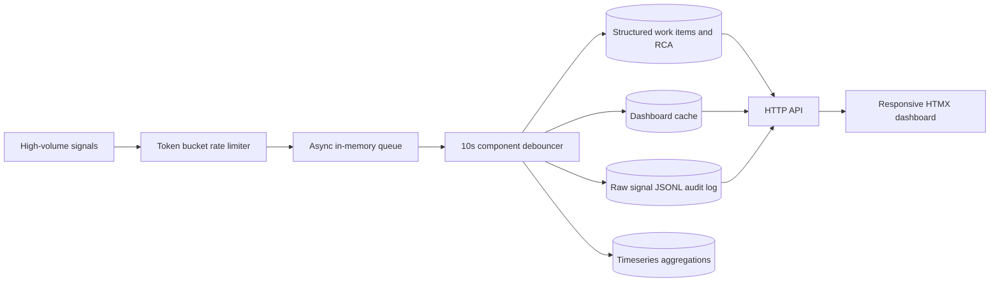

# Mission-Critical Incident Management System

Infrastructure / SRE Intern assignment for Zeotap.

## Architecture



## Tech Stack

- Backend: Node.js 20 standard library HTTP server and async event loop.
- Frontend: HTML, CSS, JavaScript with HTMX included for progressive enhancement.
- Persistence: file-backed stores split by purpose: raw JSONL audit log, structured work items, hot dashboard cache, and aggregation snapshots.
- Tests: Node's built-in `node:test`.
- Packaging: Docker Compose.

## Run Locally

```bash
cd zeotap-ims-assignment/backend
npm start
```

Open `http://localhost:8080`.

## Run With Docker Compose

```bash
cd zeotap-ims-assignment
docker compose up --build
```

Open `http://localhost:8080`.

## Seed Sample Data

With the app running:

```bash
cd zeotap-ims-assignment
node scripts/seed.js
```

The UI also has a `Simulate outage` button that sends RDBMS, MCP host, and cache signals.

## API

- `GET /health` returns service health and uptime.
- `POST /api/signals` ingests a signal asynchronously.
- `GET /api/incidents` lists active incidents sorted by severity.
- `GET /api/incidents/:id` returns one work item.
- `GET /api/incidents/:id/signals` returns raw linked signals from the audit store.
- `PATCH /api/incidents/:id/state` transitions state and enforces RCA rules.

## Backpressure

The ingestion API uses two layers:

1. A token-bucket rate limiter allows bursts while capping steady-state ingestion at 10,000 signals per second.
2. An in-memory queue has a hard limit of 50,000 signals. If persistence slows down and the queue fills, the API returns an explicit backpressure error instead of crashing.

The processor drains asynchronously, writes raw signals with retry logic, creates one work item for repeated signals from the same component within the 10-second debounce window, and keeps later signals attached to the same active incident until RCA closure.

## Resilience and Security

- Rate limiting protects the ingestion path from cascading failures.
- Store writes use bounded retries with small backoff.
- State transitions are validated centrally to prevent illegal lifecycle jumps.
- Closing an incident is rejected unless RCA is complete.
- UI-rendered incident and signal content is escaped before insertion into the page.
- `/health` supports container and load balancer health checks.
- Console throughput metrics print every 5 seconds.
- Inputs are validated for required component fields.

## Tests

```bash
cd zeotap-ims-assignment/backend
npm test
```

Covered: RCA completeness validation, mandatory RCA close guard, strict workflow transitions, MTTR calculation, repeated-signal linking, and new incident creation after closure.

## Assignment Notes

This implementation demonstrates the required architecture in a runnable single repository with `/backend` and `/frontend`. In production, the same interfaces can be backed by Kafka or NATS for ingestion, S3/OpenSearch for raw signal lake queries, PostgreSQL for transactional work items and RCA, Redis for the dashboard hot path, and Prometheus or ClickHouse for timeseries aggregations.

## GitHub

Repository link: https://github.com/Pranav188/zeotap-ims-assignment
